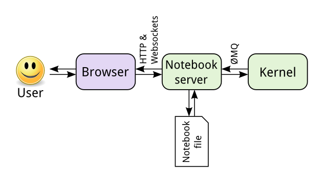

# Intro  { .white data-background="img/intro.jpg"}

## Before we begin

Code available at:

<https://github.com/balkian/lab-in-a-box>

Live demos at: 

**<https://github.todevnull.com>**

<https://lab.todevnull.com>

<https://hub.todevnull.com>


Feel free to log in, but try not to break them for now 😉


## My name is Fernando and...


## At Grupo de Sistemas Inteligentes


:::::::::::::: {.columns}
::: {.column width="50%"}

:::
::: {.column width="50%"}
- Machine Learning and Big Data
- NLP and Sentiment Analysis
- Social Network Analysis
- Agents and Simulation
- Linked Data and Semantic Technologies
:::
:::::::::::::::

<http://www.gsi.dit.upm.es>

## And I ❤ Docker


:::::::::::::: {.columns}
::: {.column width="50%"}


:::
::: {.column width="50%"}
* Docker+research for 3+ years
* Advocate for ~2 years
* Internal infrastructure: ansible, k8s and docker
* Teach (with) it
:::

::::::::::::::

## About this talk 

Takeaway: ***you can set up a multi-user data analysis environment with isolation in minutes***

Plus: using docker to perform and share experiments is even easier

Related Meetups:

[Big Data and Machine Learning with Docker](https://www.meetup.com/Docker-Madrid/events/240357800/)

[Using Docker in Machine Learning Projects](https://www.meetup.com/Docker-Madrid/events/237067604/)

# For researchers {.white data-background="img/research.jpg" style="color:white"}

<!-- ## Research is about data -->

<!-- {.noborder height="500px"} -->


## Experiment, publish, repeat


## Reproducibility


](img/goodluck.png)

## Obstacles

:::::::::::::: {.columns}
::: {.column width="50%"}

* **Missing data** 
* Bleeding edge tools and libraries
* Throwaway software
   * Hacky
   * Little to no documentation
* Multiple languages

:::
::: {.column width="50%"}
{ height=80% }
:::

::::::::::::::


## Obstacles


## Is it a problem?

](img/reproducibility.jpg){ height=80% }


## Jupyter notebooks


## Jupyter architecture




## Docker to the rescue

](img/dockerrescue.png)


## Jupyter/docker-stacks 

{ height=50% }

## Reproducible environment

```bash
docker run --rm -p 8888:8888 \
    -v $(WDIR)/:/home/jovyan/work/ \
    jupyter/scipy-notebook
```

## And friendly, too


```yaml
version: '2'
services:
  jupyter:
    image: jupyter/scipy-notebook
    volumes:
    - "./.nbconfig:/home/jovyan/.jupyter/nbconfig"
    - "./work:/home/jovyan/work/"
    ports:
    - "8888:8888""
```

```bash
docker-compose up
```

## Related projects 

* Using docker images to share trained systems

{ height=500px }

# For small groups { .white data-background="img/group.jpeg" }


## Requirements

* Shared environments
* Resource sharing
* Easy configuration
* Versioning
* Backups

And **little to no overhead**


## Isolation


## Jupyterhub


:::::::::::::: {.columns}
::: {.column width="60%"}

{ height=500px }

:::
::: {.column width="40%"}

#### Authenticators

* Local
* OAuth
* LDAP
* JWT

#### Spawners

* Local
* Docker
* Kubernetes
* Marathon

:::
:::::::::::::::

## More infrastructure

{.noborder height="250px"}
{.noborder height="250px"}

{.noborder height="250px"}

# Demo  { data-background="img/party.jpg"}

## It's demo time


{ height=80% }

<https://github.todevnull.com>
<https://github.com/balkian/lab-in-a-box>

# Other tools

## Zeppelin

* Alternative to Jupyter


## CoCalc

* Alternative to Jupyter

{ height=500px }


## Docker-Nvidia

* CUDA for docker


## Jupyter Binder

* Custom Jupyter from git repositories

{ height=500px }


## Knowledge-Repo


# Conclusions

## Lessons learned

* Docker + Docker-compose
  * Reproducible environments (partially)
  * Reduced tooling / experience
  * Ephemeral containers force you to automate/document installation
* Jupyterhub
  * Shared environments
  * Web interface (zero knowledge)
  
## What's missing?

* Roles and permissions
* Backups

* Ideas:
  * Kubernetes?
  * OpenShift?

##  Thanks for listening!

<https://github.com/balkian/lab-in-a-box>

<jf.sanchez@upm.es>

